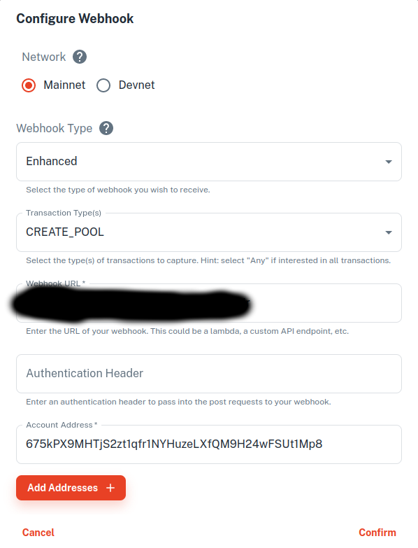

### Solana Testing / Trading / Experimenting

#### Helius Webhooks

This project uses Webhooks from Helius to get notified of newly created liquidity pools on Raydium.
The webhook configured on Helius should look something like this:



You're going to need your own domain and server setup. Below is a simple example using NGINX.
Make sure to configure the DNS to point to your server.

#### Server NGINX configuration

```nginx
server {
  server_name yourdomainhere.com;

  location / {
    proxy_pass http://localhost:3447;
    proxy_http_version 1.1;
    proxy_set_header Upgrade $http_upgrade;
    proxy_set_header Connection 'upgrade';
    proxy_set_header Host $host;
    proxy_cache_bypass $http_upgrade;
  }

  listen 443 ssl; # managed by Certbot
  ssl_certificate /etc/letsencrypt/live/yourdomainhere.com/fullchain.pem; # managed by Certbot
  ssl_certificate_key /etc/letsencrypt/live/yourdomainhere.com/privkey.pem; # managed by Certbot
  include /etc/letsencrypt/options-ssl-nginx.conf; # managed by Certbot
  ssl_dhparam /etc/letsencrypt/ssl-dhparams.pem; # managed by Certbot

}

server {
    if ($host = yourdomainhere.com) {
        return 301 https://$host$request_uri;
    } # managed by Certbot


    if ($host = yourdomainhere.com) {
        return 301 https://$host$request_uri;
    } # managed by Certbot

    listen 80;
    server_name yourdomainhere.com;
    return 404; # managed by Certbot
}
```

#### Telegram Notifications

Telegram Notifications are built in. Change your telegram information in the environment file.

#### Environment Setup

Copy the example .env.example file to .env

```
cp .env.example .env
```

Populate the data in the file as described.

#### Setup and run the application

After you've cloned the repository:

```
npm install # install required packages
npx tsc # compile typescript code to javascript
node js/index.js # run the application
```
